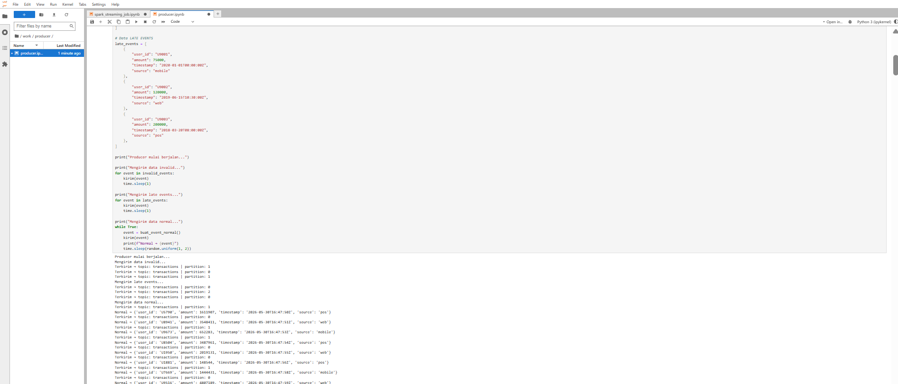
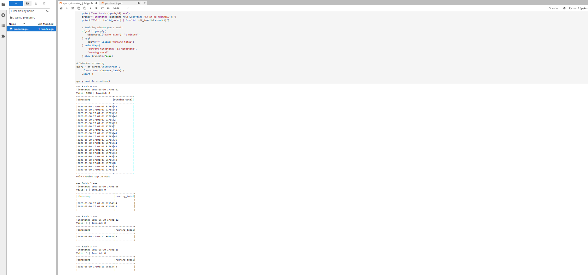
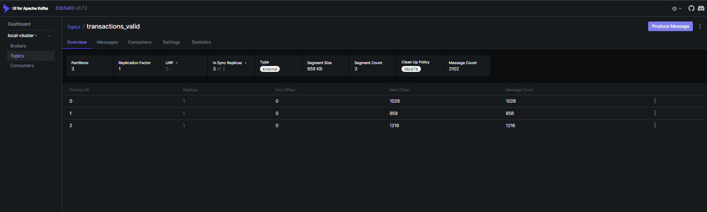
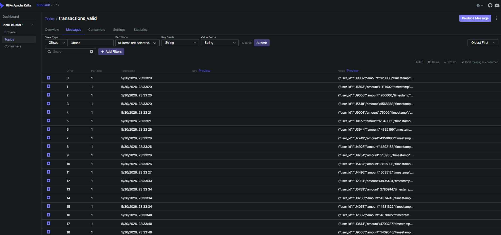
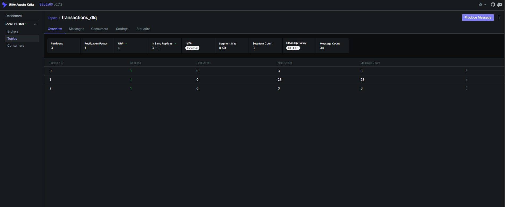
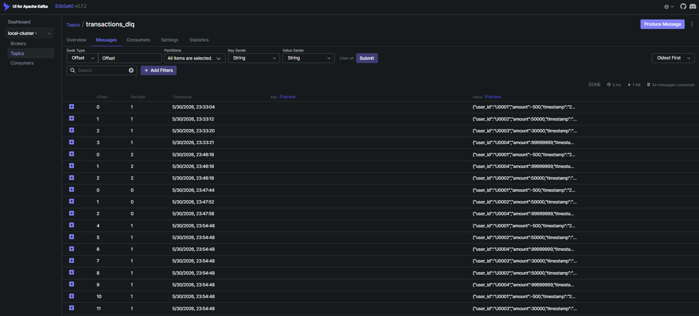

# day48-StreamingForDataPipeline

## Tools yang Digunakan
- Apache Kafka 
- PySpark Streaming
- Kafka UI 
- Jupyter Notebook
- Python 
- Docker 

## Validasi yang Diterapkan
1. **Mandatory field check** → cek user_id, amount, timestamp tidak boleh null
2. **Type validation** → amount harus berupa angka
3. **Range validation** → amount harus antara 1 sampai 10.000.000
4. **Source validation** → source hanya boleh "mobile", "web", atau "pos"
5. **Invalid timestamp** → timestamp tidak bisa diparse dianggap invalid

## Jenis Data yang Dikirim Producer
- **Data normal** → transaksi valid, dikirim tiap 1-2 detik
- **Data invalid** → amount negatif, source tidak dikenal, timestamp tidak valid, amount terlalu besar
- **Late events** → timestamp jauh di masa lalu (simulasi data terlambat)

## Cara Menjalankan

### 1. Jalankan Docker
```bash
docker-compose up -d
```
Tunggu sebentar

### 2. Buat Topic di Kafka
```bash
docker exec -it kafka bash
kafka-topics --create --topic transactions --bootstrap-server localhost:9092 --partitions 3 --replication-factor 1
kafka-topics --create --topic transactions_valid --bootstrap-server localhost:9092 --partitions 3 --replication-factor 1
kafka-topics --create --topic transactions_dlq --bootstrap-server localhost:9092 --partitions 3 --replication-factor 1
```

### 3. Jalankan Spark Streaming Job
Buka Jupyter di localhost:8888, jalankan spark_streaming_job.ipynb (untuk keperluan execute di jupyter gunakan format .ipynb) dari cell 1 sampai selesai.

### 4. Jalankan Producer
Buka tab baru di Jupyter, jalankan producer.ipynb. (untuk keperluan execute di jupyter gunakan format .ipynb)

### 5. Monitor
- Kafka UI: localhost:8080
- Jupyter: localhost:8888

## Output
- Data valid masuk ke topic transactions_valid
- Data invalid masuk ke topic transactions_dlq

## Screenshots
### Producer Output


### Streaming Console Output


### Topic transactions_valid



### Topic transactions_dlq


